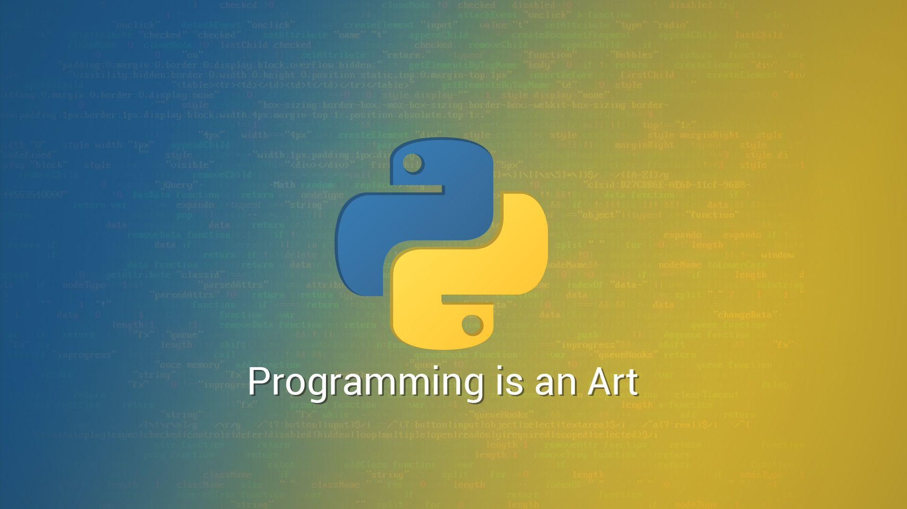
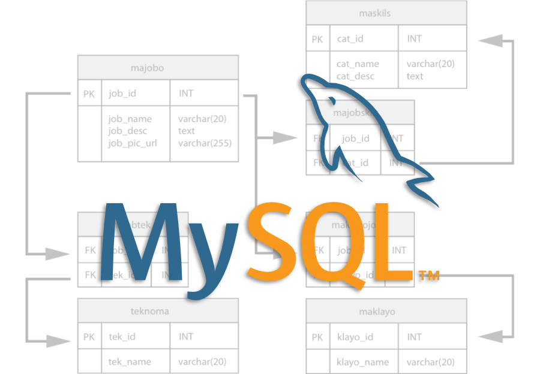

# :grin:Hello, I am Keryn López:stuck_out_tongue_closed_eyes:

### Index
- [Welcome to my profile](#welcome)
- [About this repository](#about-this-repository)
- [How to use this repository](#how-to-use-this-repository)
- [Who am I? What do I know? Who do I want to be?](#who-am-i)
- [Summary](#summary)

---

## Welcome to my profile :wave:
---

## About this repository :briefcase:
---
- _This repository is used to explain my programming progress, including projects that I created (maybe with help of other programmers) and my objetives as programmer._
---

## How to use this repository
- _There are some words (excepting "future" and "colaborate") that maybe you do not know (such as Windows Subsystem for Linux 2), those have a badge where you can touch and sent you to a webpage that explain you its meaning._
- _Apps related to messaging (such as: Gmail or Discord) Have links to my profile in those apps so you can contact me and work together._
---

## :monocle_face:Who am I? What do I know? Who do I want to be?:thinking:
---
- _I am a 17 years old boy with **big dreams** to chase :star2:. I speak in English, but my native language is Spanish :es:-:us:_
- _I am a [)](https://en.wikipedia.org/wiki/Python_(programming_language)) developer who always like to **learn** new things and I like to  with other **developers** :busts_in_silhouette:._
- _To create my **code** I use  on my  and  as my **source code editor.**:technologist:_

- _I am **learning** about . I learned about how to create databases, tables, and others. In the  I would like to **master** _

- _I learned 50% of . Someday, I will master it too._

- _I would like to be a , a  and a ._
- _I would like to **create** a **strong team**, composed by **creative people.** So if **you** have a good **idea**, **you can reach me out** on my  or on my  too._

---

## Summary
---

