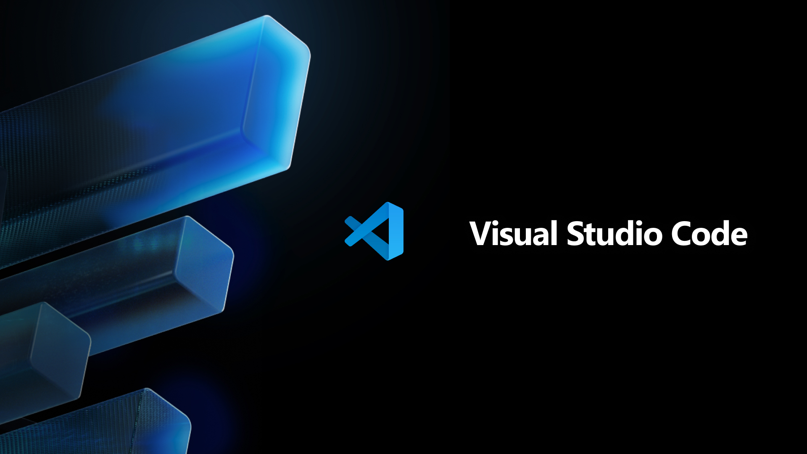

# :grin:Hello, I am Keryn López:stuck_out_tongue_closed_eyes:

---
## Welcome to my profile:wave:
---

## :monocle_face:Who am I? What do I know? Who do I want to be?:thinking:
---
- _I am a 17 years old boy with **big dreams** to chase_:star2:
- _Currently I am a  developer who always like to **learn** new things and I like to  with other **developers**._

- _To create my **code** I use on my  and  as my **source code editor.**_

- _I am **learning** about . I learned about how to create databases, tables, and others. In the  I would like to **master** _
- _I will like to be a **fullstack developer**, a **cibersecurity specialist** and a **IA developer.**_
- _I would like to **create** a **strong team**, composed by **creative people.** So if **you** have a good **idea**, **you can reach me out** on my **discord**_